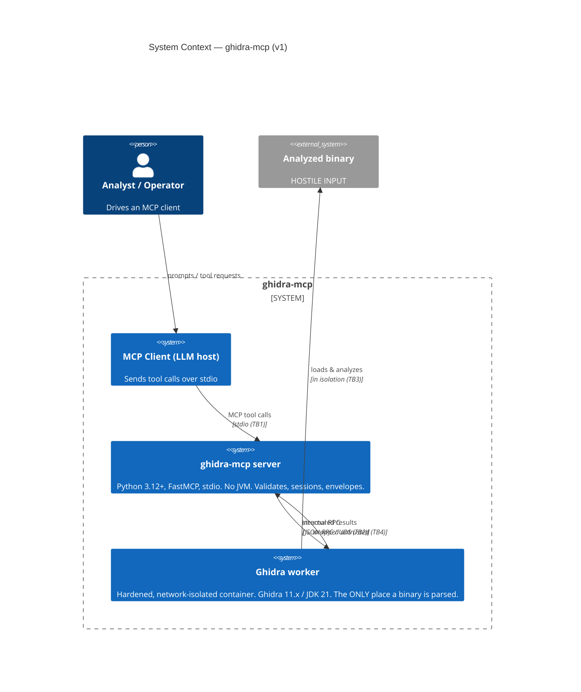
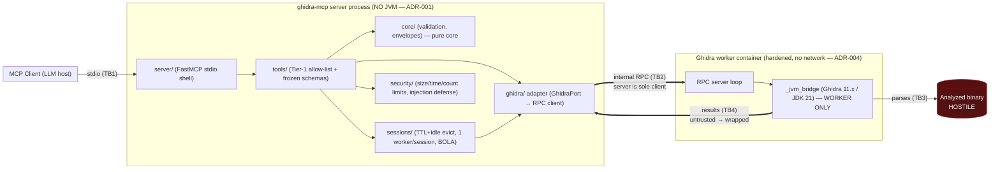

# Architecture Overview — `ghidra-mcp`

> Source of truth for delivery: [`PLAN.md`](../PLAN.md). Decisions are recorded as ADRs in
> [`docs/adr/`](adr/). The threat model is [`docs/security/threat-model.md`](security/threat-model.md).
> Frozen contracts (RPC, tools, envelopes) are in [`docs/contracts/`](contracts/).

## Purpose

`ghidra-mcp` exposes Ghidra reverse-engineering capabilities to LLM clients as **MCP tools**. The
analyzed binary is **hostile input**; the central design goal is to **contain the analyzer** so a
malicious binary cannot escape, exfiltrate, or destabilize anything, and so its output cannot
hijack the LLM via prompt injection.

## Key decisions (see ADRs)

| # | Decision | ADR |
|---|----------|-----|
| 1 | Ghidra runs **out-of-process** in a hardened worker; the server never loads the JVM or parses a binary. | [ADR-001](adr/ADR-001-out-of-process-ghidra.md) |
| 2 | **One worker per session**, killed on eviction; per-session store verified-wiped. | [ADR-002](adr/ADR-002-one-worker-per-session.md) |
| 3 | **Container-only**; Ghidra 11.x + JDK 21 pinned **by digest**; host unsupported. | [ADR-003](adr/ADR-003-container-only-ghidra-jdk.md) |
| 4 | Isolation tier: rootless OCI baseline + **gVisor** for the worker. | [ADR-004](adr/ADR-004-isolation-tier.md) |
| 5 | **Untrusted-data envelope** wraps all binary-derived output. | [ADR-005](adr/ADR-005-untrusted-data-envelope.md) |
| 6 | **stdio-first**; HTTP transport is a gated v1.1 increment. | [ADR-006](adr/ADR-006-stdio-first-transport.md) |

## Component model (ports & adapters)

The server follows **functional core / imperative shell** (`topic-architecture-patterns`): pure
domain logic (validation, envelopes) at the center; I/O (MCP transport, the Ghidra worker) at the
edges; the core depends on a **port** (`GhidraPort`), not on the concrete worker adapter.

### Package layout (`src/ghidra_mcp/`)

| Path | Role | Workstream |
|------|------|-----------|
| `core/` | Pure validation + frozen envelopes (untrusted-data, error). **Critical path.** | WS0 (contracts), WS1/WS4 (logic) |
| `tools/` | Tier-1 read-only catalog: frozen `schemas`, allow-list `registry`, handlers. | WS0 (schemas), WS1 |
| `sessions/` | Per-binary session lifecycle, eviction, BOLA authorization. **Critical path.** | WS2 |
| `security/` | Pre-worker resource limits + injection defenses. **Critical path.** | WS4 |
| `server/` | FastMCP stdio shell; composition root. | WS1 |
| `ghidra/` | Adapter: `port` (interface), `rpc_client` (server-side), `_jvm_bridge` (**worker-only**). | WS2 |
| `config.py`, `logging.py`, `__main__.py` | Config (fail-closed), redacting logs, entry point. | WS1 |

## Request flow (a tool call)

1. **Client → server (TB1):** MCP tool call over stdio. The server validates arguments against
   the frozen pydantic schema + `core.validation` (allow-list, fail closed).
2. **Authorize session:** `sessions.SessionManager.authorize()` resolves the opaque session id
   (BOLA defense) and refreshes its idle clock.
3. **Bound:** `security.limits` enforces size/count/time caps *before* the worker.
4. **Server → worker (TB2):** the `GhidraPort` adapter sends an RPC request over the per-session
   socket, under a per-call timeout. On timeout it **kills the worker**.
5. **Worker → binary (TB3):** inside the isolated container, the JVM bridge runs the Ghidra
   operation. No network, dropped caps, gVisor, resource limits.
6. **Worker → server → client (TB4):** structured results return; all binary-derived content is
   wrapped in the **untrusted-data envelope**; failures become **error envelopes**. Nothing is
   auto-executed.

## What v1 does NOT include (extensibility, not built)

- **HTTP transport** — design is transport-configurable, but only stdio is built/hardened in v1
  (ADR-006). HTTP re-imports `std-owasp-api` + `std-zero-trust` and gets its own threat model.
- **Tier-2 reporting/metrics** and **mutation tools** / `runScript` — deferred to v1.1; the tool
  registry is an explicit allow-list so adding them is a reviewed, gated change.

## Observability & ops

Structured JSON logs to stderr (stdout is the stdio transport), with **mandatory redaction** (no
binary content/secrets). Operational procedures live in [`docs/runbooks/`](runbooks/), including
**evicting/rotating a poisoned worker** and **patching a Ghidra/JDK CVE via a digest bump**.
