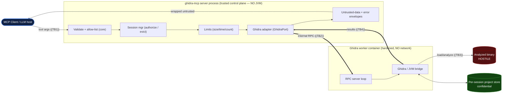

# Threat Model — `ghidra-mcp` (v1, stdio)

> Method: STRIDE over a data-flow diagram (`workflow-threat-model`). Scope: v1 (Tier-1 read-only,
> **stdio only**). HTTP transport, Tier-2 reporting, and mutation tools are out of scope (separate
> threat model in v1.1 — ADR-006). Source of truth: [`PLAN.md`](../../PLAN.md).
> **Data classification:** the analyzed binary and all derived artifacts are **confidential** and
> of **hostile origin** (master §5).

## 1. Assets

- **A1 — The host / control plane:** the machine and the trusted MCP server process. Compromise =
  worst case.
- **A2 — Confidentiality of analyzed artifacts:** one client's binary + derived data must not leak
  to another session or off-host.
- **A3 — Availability:** the server must stay responsive under hostile/oversized inputs.
- **A4 — Integrity of the LLM interaction:** the LLM must not be hijacked by injected content from
  a binary (indirect prompt injection).

## 2. Trust boundaries & data-flow diagram

The four boundaries are fixed by PLAN §4.

| TB | Crossing | Why it's a boundary | Stance |
|----|----------|---------------------|--------|
| **TB1** | client → server | untrusted tool args | validate + allow-list, fail closed |
| **TB2** | server → worker | process/container line; server is sole client | internal RPC, no external clients, bounded |
| **TB3** | binary → analyzer | **HOSTILE**; primary containment | isolate, no egress, bounded, kill-on-timeout |
| **TB4** | worker → server → LLM | untrusted output (prompt injection) | untrusted-data envelope, never auto-execute |

## 3. STRIDE per element / flow

Likelihood × Impact → severity (master §7). "L/M/H".

### TB1 — Client → Server (tool args)
| STRIDE | Threat | L×I | Mitigation (control · module) |
|--------|--------|-----|-------------------------------|
| **S** | Client forges identity | N/A in v1 — local stdio, single trusted host; no auth boundary inside one process | — (HTTP v1.1 adds authn — `topic-authn-authz`) |
| **T** | Malformed/oversized args, mass-assignment via extra fields | M×M=**Med** | pydantic frozen schemas, `extra="forbid"`, `core.validation` allow-list; bounds on every field (`std-owasp-proactive` #5, CWE-20) |
| **R** | Client denies issuing a call | L×L=**Low** | structured audit log: tool name, session id, sizes, outcome (redacted — `topic-logging-observability`) |
| **I** | Error messages leak internals (paths, stack, JVM detail) | M×M=**Med** | RFC 9457 error envelope; generic `detail`, diagnostics logged not returned (`topic-error-handling`) |
| **D** | Flood of calls / huge args exhausts the server | M×M=**Med** | per-tool timeout, payload caps, concurrency cap + backpressure (`topic-reliability`, F7) |
| **E** | Arg drives privileged behavior (e.g. `runScript`, path traversal) | M×H=**High** | **no mutation / no script surface in v1**; tools are a fixed allow-list; path-like args resolved + confined server-side (CWE-22) |

### TB2 — Server → Ghidra worker (internal RPC)
| STRIDE | Threat | L×I | Mitigation |
|--------|--------|-----|------------|
| **S** | A rogue local process talks to the worker | L×H=**Med** | per-session **Unix domain socket** with restrictive perms in a private dir; no TCP; server is the sole client (`docs/contracts/rpc-protocol.md`) |
| **T** | Tampered RPC frames | L×M=**Low** | local-only socket; length-prefixed framing + strict schema validation of every frame; reject malformed |
| **R** | — | — | RPC calls correlated to the tool call in logs |
| **I** | Worker leaks more than requested over RPC | M×M=**Med** | worker returns only the requested, size-capped result; server re-validates + caps |
| **D** | Worker hangs holding the RPC, stalling the server | M×M=**Med** | per-call timeout that **kills the worker**; adapter never blocks unbounded (`topic-reliability`) |
| **E** | Compromised worker pivots to the server via RPC | L×H=**Med** | server treats worker output as **untrusted** (TB4); strict frame schema; no code/paths from worker are executed/trusted |

### TB3 — Binary → Ghidra analyzer (**HOSTILE — primary boundary**)
| STRIDE | Threat | L×I | Mitigation |
|--------|--------|-----|------------|
| **S** | n/a (data, not a principal) | — | — |
| **T** | Malicious binary corrupts analyzer state / poisons results | M×M=**Med** | one worker per session, disposable; **kill + verified-wipe on evict** (ADR-002); poisoned-worker rotation runbook |
| **R** | — | — | per-session worker lifetime logged |
| **I** | Binary exfiltrates data or reads host | M×H=**High** | **no network/egress**; read-only rootfs; dropped caps; gVisor; tmpfs scratch (ADR-004) |
| **D** | **Decompile bomb / pathological input** hangs or OOMs the analyzer | H×M=**High** | wall-clock timeout **kills the worker**; memory/pids limits; max input size enforced **before** Ghidra; fuzz/abuse tests (F7, WS4) |
| **E** | **Loader/analyzer RCE** (memory-safety/deserialization in Ghidra parsing hostile bytes) | M×H=**High** | out-of-process (ADR-001) + full isolation stack (ADR-004) contains it to a disposable, network-less worker; CVE-track + patch Ghidra/JDK by digest |

### TB4 — Worker → Server → LLM (untrusted output)
| STRIDE | Threat | L×I | Mitigation |
|--------|--------|-----|------------|
| **S** | Content impersonates a system/tool instruction to the LLM | H×M=**High** | **untrusted-data envelope** (ADR-005); documented "do not auto-execute/render/follow" contract; injection abuse tests (WS4) |
| **T** | Content rendered as active markup/links by the client | M×M=**Med** | envelope `encoding`/`notes`; WS4 normalization of control/bidi/zero-width chars; inert-text rendering contract |
| **R** | — | — | — |
| **I** | Confidential artifacts over-returned to the wrong caller | M×H=**High** | session-scoped results (BOLA — TB1/sessions); response size caps; no cross-session reuse (ADR-002) |
| **D** | Huge output payload exhausts client/server | M×M=**Med** | `max_response_bytes` + per-tool result caps; pagination on all lists (F7) |
| **E** | **Indirect prompt injection** escalates the agent to take harmful actions | H×H=**Critical** | envelope + never-auto-execute; least agency (`std-owasp-llm` LLM08); the tools are **read-only** (no destructive action exists to trigger); WS4 injection suite |

### Cross-cutting: Per-session project store (confidentiality)
| STRIDE | Threat | L×I | Mitigation |
|--------|--------|-----|------------|
| **I** | **Cross-session leakage** of one binary's store to another | M×H=**High** | one worker/session; per-session store path; **verified wipe on evict** (ADR-002); cross-session isolation abuse test (WS4) |
| **D** | Stores accumulate and exhaust disk | M×M=**Med** | TTL/idle eviction reclaims; concurrency cap bounds live stores; tmpfs option |

## 4. Supply chain (build-time)
| Threat | L×I | Mitigation |
|--------|-----|------------|
| Compromised/typosquatted Python dep | M×H=**High** | pin + hash lockfile; vet new deps; SCA (pip-audit) gate (`std-supplychain`, `workflow-cve-management`) |
| Tag-mutated / poisoned Ghidra/JDK image | M×H=**High** | pin **by digest** (ADR-003); SBOM; gated image pulls; CVE tracking + digest-bump runbook |
| Compromised CI action | L×H=**Med** | pin CI actions **by digest**; least-privilege OIDC; ephemeral runners (`workflow-cicd`) |

## 5. Residual risk & assumptions

- **Prompt injection is not fully preventable** — the envelope + read-only tools + never-auto-execute
  **limit blast radius**; the agent host must honor the rendering contract. Tracked as the top
  residual risk; revisit when mutation tools (v1.1) are considered (they raise LLM08 sharply).
- **Sandbox escape from gVisor + no-network** is assumed hard but not impossible; defense-in-depth
  (ADR-001/004) and CVE patching are the controls. A confirmed escape → incident response.
- **Out of scope (v1):** remote/network attackers (no HTTP), authn/multi-tenant authz, mutation.

## 6. Abuse-case list for WS4 (REQUIRED — acceptance criteria)

These map 1:1 to `tests/security/test_abuse_cases.py` (scaffolded, skipped until WS4). Each uses
**benign/synthetic fixtures only — never real malware** (master §5, PLAN §6). Each must FAIL the
attack (the control holds) and be a deterministic, hermetic test.

1. **Decompile-bomb / analysis hang** — a pathological function/CFG must hit the tool/analysis
   timeout and **kill the worker**; the server stays responsive. (TB3-D)
2. **Oversized binary** — an input above `max_binary_bytes` is **rejected before** any byte reaches
   Ghidra. (TB3-D / limits)
3. **Zip / decompression bomb** — archive/decompression-ratio abuse is rejected by the size/ratio
   guard (if/when archive inputs exist). (TB3-D)
4. **Malformed-loader RCE attempt** — a crafted/corrupt format input crashes only the **contained
   worker**; no host/server impact; worker is evicted + wiped. (TB3-E)
5. **Indirect prompt injection via strings/symbols/comments** — payloads in binary-derived content
   are returned **wrapped in the untrusted-data envelope**, normalized/annotated, never as bare
   instruction text. (TB4-S/E)
6. **Session-ID guessing / BOLA** — foreign or guessed session ids return `SESSION_INVALID` without
   revealing whether other sessions exist; one session cannot address another's data. (TB1/TB4-I)
7. **Worker-pool starvation / resource exhaustion** — exceeding the concurrency cap yields
   **backpressure** (`LIMIT_EXCEEDED`), not exhaustion; timeouts reclaim stuck workers. (TB1-D/TB3-D)
8. **Cross-session project-store leakage** — one session cannot read another's store; eviction
   performs a **verified wipe** (assert the store is gone). (store-I / ADR-002)

## 7. Open items feeding the model (PLAN §9)
- Exact Ghidra 12.1.2 patch version + headless integration (SME) — affects TB3 CVE surface.
- Final RPC mechanism + serialization (recommended in `docs/contracts/rpc-protocol.md`) — affects TB2.
- Project-store location (volume vs tmpfs) + verified-wipe mechanism — affects store-I/D (ADR-002).

## 8. Addendum — v1.1 semantic-naming tools (ADR-007)

The five new tools (`call_graph`, `callees`, `callers`, `analysis_order`, `function_context`) add
surface but introduce **no new trust boundary**: still a single **stdio** process, still
**read-only**, still **output-only** (the tools NEVER mutate the Ghidra DB). They sit on the
existing TB1 (client args), TB3 (hostile binary → analyzer, for graph extraction), and TB4 (untrusted
output → LLM) boundaries. The naming/synthesis intelligence runs on the **client** (no server-side
LLM), so server-side agency risk (LLM08) is unchanged.

New/relevant threats and controls:

| STRIDE | Threat | Control |
|--------|--------|---------|
| **D** | **Graph-bomb** — a hostile binary presents an enormous fan-out call graph (millions of edges) to exhaust memory/time | Node/edge caps enforced at the tool boundary **before** the worker (`max_nodes ≤ 50k`, `max_edges ≤ 200k`); worker stops at the cap and sets `truncated`. (TB3-D / TB4-D, std-owasp-llm LLM04) |
| **D/I** | **String-flood / injection via `referenced_strings`** — a function referencing huge or attacker-crafted string literals to exhaust output or smuggle a prompt-injection payload | `max_strings ≤ 1024` cap enforced at the tool boundary and again in the worker (de-duplicated by target address, `truncated` on clip); every value stays `Untrusted[...]` (`BINARY` origin) and is normalized at the `core.envelope.wrap` chokepoint — client renders inert. (TB3-D / TB4-I, ADR-005) |
| **D** | **Deep recursion / long-chain** — a deeply nested or very long call chain | `max_depth ≤ 256` traversal cap; the **pure ordering core is iterative** (no Python recursion) so it cannot stack-overflow at any size. (TB3-D) |
| **D** | **Cycle abuse** — densely cyclic/mutually-recursive graph to blow up an ordering algorithm | SCC condensation is `O(V+E)` Tarjan (iterative); cycles collapse to one component; deterministic, bounded by node/edge caps. (TB3-D) |
| **I/S** | **Untrusted graph + decompiled C** — node names, comments, and pseudo-C in `function_context` carry indirect-prompt-injection payloads | All binary-derived names + decompiled C stay `Untrusted[...]`, normalized/annotated at the `core.envelope.wrap` chokepoint; client renders inert (TB4 — same control as abuse-case 5, ADR-005). |
| **I** | **Misleading-incomplete graph** — unresolved indirect/virtual calls silently dropped would hide real control flow and mislead naming | Unresolved edges are **surfaced** in `unresolved_callers` / `has_unresolved_calls`, never dropped (honesty; the client knows the inference is incomplete). |
| **T** | **DB tampering via naming** | Out of scope by design — tools are read-only/output-only; no rename/retype/comment-write/`runScript` exists (ADR-007). |

**Residual risk (added to §5).** Synthesized C is **best-effort**: compile-rate and behavioral
equivalence are **measured, not guaranteed** (ADR-007) — a client must not treat recompiled C as a
faithful reproduction. Indirect prompt injection via graph node names / decompiled C in
`function_context` carries the same residual risk as abuse-case 5 (the envelope is defense-in-depth,
not a guarantee).

### Abuse cases for the v1.1 build fan-out (append to §6; benign/synthetic fixtures only)

9. **Graph-bomb** — a synthetic binary/graph with edge count above `max_edges` returns a
   `truncated` graph capped at the limit, not an OOM; the server stays responsive. (TB3-D/TB4-D)
10. **Deep-recursion chain** — a synthetic deep call chain is ordered without recursion/stack
    overflow and respects `max_depth`. (TB3-D)
11. **Cycle / mutual-recursion** — a synthetic cyclic graph condenses to a single recursive
    component; the order is total and deterministic; `is_recursive`/`self_recursive` are set. (TB3-D)
12. **Unresolved-edge surfacing** — a synthetic indirect/virtual call site appears in
    `unresolved_callers` / `has_unresolved_calls`, is never silently dropped. (TB4-I)
13. **Injection via graph node name / decompiled C in `function_context`** — a planted payload in a
    node name or pseudo-C is returned `Untrusted`-wrapped + normalized, never as bare instructions.
    (TB4-S/E — extends abuse-case 5)

## 9. Addendum — v1.1 Tier-2 reporting/metrics tools (ADR-008)

The Tier-2 tools (`cyclomatic_complexity`, `list_imports`, `list_exports`, `coverage`, `ioc_scan`,
`crypto_constant_scan`, `call_graph_metrics`, `program_summary`) add surface but **no new trust
boundary**: still single **stdio**, **read-only**, **output-only** (no Ghidra DB mutation). They sit
on TB1 (client args), TB3 (hostile binary → analyzer, for the 4 new extraction RPCs), and TB4
(untrusted output → LLM). Derivation is JVM-free (pure core — ADR-001); the metrics/scan
intelligence is server-side, not agentic.

New/relevant threats and controls:

| STRIDE | Threat | Control |
|--------|--------|---------|
| **I/S** | **Injection via `ioc_scan` matches** — a planted string (e.g. a "URL"/"domain"/"path" that is actually a prompt-injection payload) is matched and returned | The matched `value` is `Untrusted[...]` (BINARY origin), normalized at the `core.envelope.wrap` chokepoint; surfaced as inert data the client must NOT follow/fetch/execute (TB4 — extends abuse-case 5, ADR-005). |
| **I/S** | **Injection via import/export/crypto-finding names/detail** | All binary-derived names/detail wrapped `Untrusted`; addresses/categories/algorithm labels are server-computed/closed-vocabulary, bare. (TB4) |
| **D** | **Scan-bomb** — a binary with millions of strings / huge data to exhaust the IOC/crypto scan | `ioc_scan` scans a bounded page (`limit`) with per-string length caps before regex (ReDoS-safe, linear patterns); `crypto_constant_scan` runs a bounded set of already-bounded `search_bytes`; both set `truncated`. (TB3-D / CWE-400) |
| **D** | **Metric-bomb** — pathological CFG/call-graph to blow up complexity/metrics | `cyclomatic_complexity` is `O(1)` arithmetic over worker-capped block/edge counts; `call_graph_metrics` inherits the ADR-007 node/edge/depth caps and the iterative (no-recursion) core. (TB3-D) |
| **I** | **Misleading heuristics** — IOC/crypto scans yield false positives/negatives presented as authoritative | Tools are documented + framed as **heuristic triage aids, not authoritative detections** (ADR-008 caveat); findings are leads, not verdicts. `cyclomatic_complexity` returns `incomplete` + raw block/edge counts; `coverage` measures *defined*, not ground truth. |
| **T** | **DB tampering via reporting** | Out of scope by design — Tier-2 is read-only/output-only; no mutation tool exists (ADR-008; mutation tier is a separate gated increment). |

**Residual risk (added to §5).** IOC/crypto scans are heuristic — a client must not treat a hit as
proof or a miss as clean. The same indirect-prompt-injection residual as abuse-case 5 applies to all
binary-derived Tier-2 strings (the envelope is defense-in-depth, not a guarantee).
